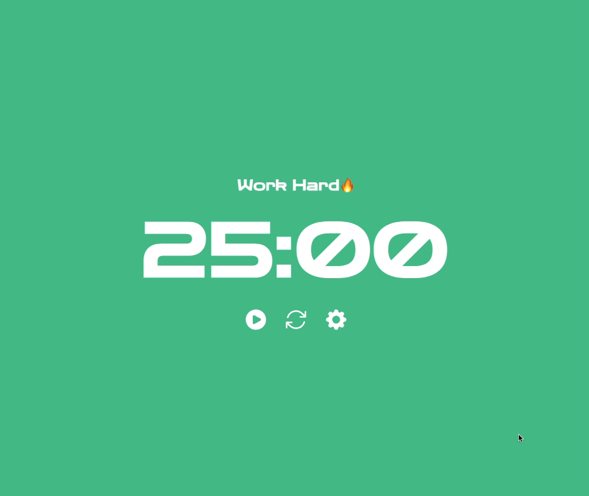
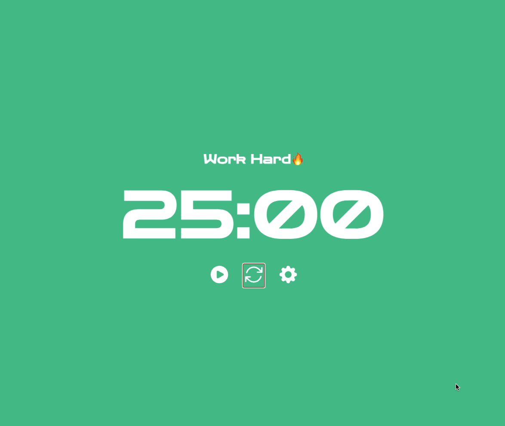
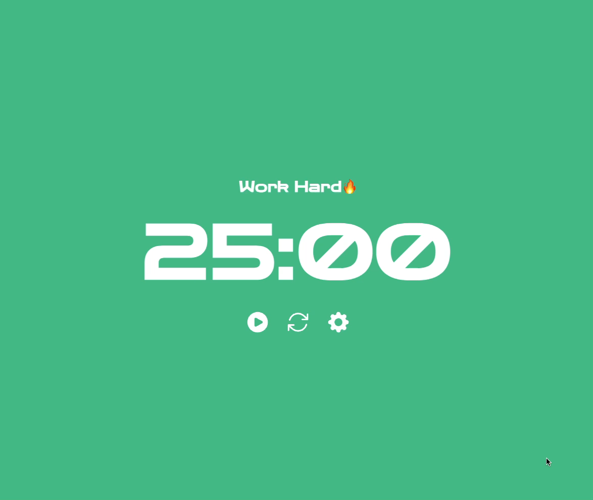

# 포모도로 타이머

Vue Options API를 통해 포모도로 타이머를 구현하는 프로젝트입니다.

## 구현 기능

- **타이머 시작/중단**

  

사용자가 설정한 타이머를 시작하고 중단할 수 있습니다.

- **타이머 초기화**

  

타이머를 초기화할 수 있습니다.

- **타이머 모드 자동 전환(작업/휴식)**

  

사용자가 설정한 시간이 지나면 작업/휴식 모드가 순서대로 전환됩니다.

- **타이머 시간 사용자 설정**

  

사용자가 원하는 시간을 설정할 수 있습니다.
